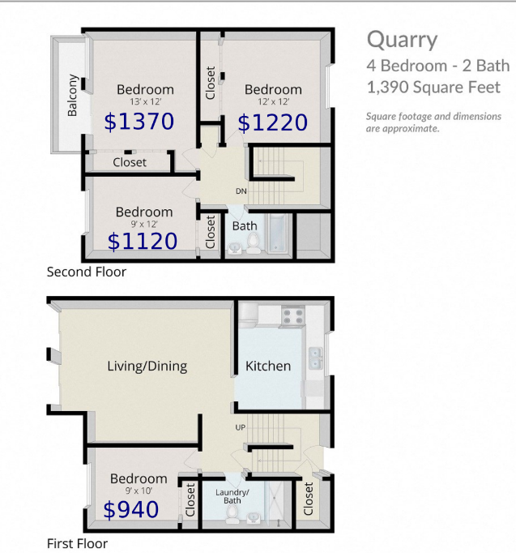
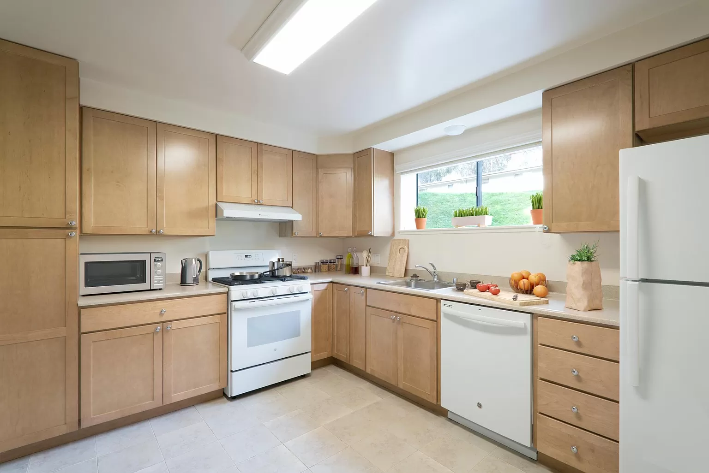

# Come live at 817 Quarry Road!
 

If you love nature but also love living in the city, the presidio is perfect for you! I've been living here for 2 years now and can't think of a place for me in SF.

I'm looking for 2 roommates to move in by Aug. 31 or earlier if desired.

## The bedrooms

### Enzo's Room ($940/m)

- 9' x 10'
- Closet space
- East facing window

 

### Blake's Room ($1120/m)

- 9' x 12'
- Closet space
- East facing window

 

## About the Apartment

It's a 4BR 1.5BA apartment with 
- In unit washer dryer
- A backyard
- Bike storage shed 
- Front yard
- Kitchen with dishwasher, range/stove, appliances, etc.
- Large living room with couches, TV, dining table, etc.
- Designated closet space

Utilities are generally ~$130/m

We like to keep things organized so we each have our own sections for storage in the closets, kitchen, and fridges.

## About Us
We are recent college graduates, 22 and 23, we like art, music, cooking, dancing, meditation, and the outdoors. 

 
TJ at China Beach. 

### Floor Plan

 

### Living Room

 

### Kitchen (Example)

 

## Apply here!

[https://docs.google.com/forms/d/e/1FAIpQLSdgZ1_P7tYpvO-FaOH6Xd-NhfU3ro-qbGqekUXdLPnVKl8ibw/viewform?usp=sf_link](https://docs.google.com/forms/d/e/1FAIpQLSdgZ1_P7tYpvO-FaOH6Xd-NhfU3ro-qbGqekUXdLPnVKl8ibw/viewform?usp=sf_link)